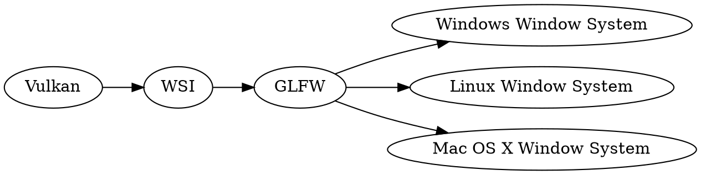
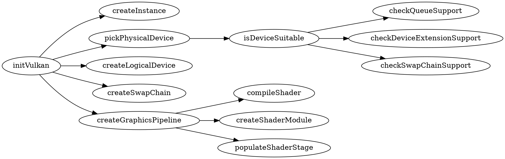

In this article, I'd like to summarize and share my impressions after going through the Vulkan tutorial's [Presentation](https://vulkan-tutorial.com/Drawing_a_triangle/Presentation/Window_surface) and [Graphics pipeline basics](https://vulkan-tutorial.com/Drawing_a_triangle/Graphics_pipeline_basics/Introduction) sections.

> This is the second article in the series where I share my impressions after following the Vulkan's tutorial using Scala 3 – here is the [first article](/posts/2022-06-10-vulkan-setup). For every chapter, I implement an example in a separate file. The examples repository is available on GitHub: [anatoliykmetyuk/Vulkan-Tutorial-Scala](https://github.com/anatoliykmetyuk/Vulkan-Tutorial-Scala). In its structure, it follows the [Java implementation](https://github.com/Naitsirc98/Vulkan-Tutorial-Java), so it is also a good chance to compare how Scala and Java approaches to the same task differ.

<!-- more -->
## Window Surface
The Vulkan tutorial's section on [Presentation](https://vulkan-tutorial.com/Drawing_a_triangle/Presentation/Window_surface) covers the interaction of Vulkan with the OS's window system. Vulkan's specification does not define a way to interface with the window system – for that, we need to enable WSI – Window System Integration – via an extension.

Every OS has its own window system and thus interfacing with them is platform-dependent. Fortunately, there are libraries like [GLFW](https://www.glfw.org/) which abstracts the platform away, allowing the code to run on any operating system.



The WSI API provides our application with a so-called Window Surface which represents a window to render to.

## Swap chain
A swap chain is a queue of frames that are waiting to be displayed on the screen. The frames present us with buffers we can render to. These buffers are represented with _views_ when we work with them. These views allow us to specify which part of the buffer we want to access and for which purpose. Our application will render to these views, and the result will be displayed on the screen.

An important goal we try to achieve with the swap chain is to sync image presentation with the screen refresh rate. If the presentation rate is higher than the screen refresh rate, then the presented image may change in the middle of the screen refresh, thus causing the tearing effect.

# Graphics Pipeline
The process of rendering an image on the screen consists of a sequence of steps called the _graphics pipeline_. The [tutorial on the graphics pipeline](https://vulkan-tutorial.com/Drawing_a_triangle/Graphics_pipeline_basics/Introduction) has the following image as an overview of the pipeline:

[](https://vulkan-tutorial.com/Drawing_a_triangle/Graphics_pipeline_basics/Introduction)

Say you want to render a model of a car on screen. The model is composed of polygons – geometric 2D shapes that exist in the 3D space and look like a car when put together.

[](https://media.sketchfab.com/models/8e01a3fba80c4fbcad19cc768494e91f/thumbnails/1c7f757c53234812bcfd56b8c7ac482a/791c489b8dcd45e2b62f1cfae17ba982.jpeg)

Each polygon in turn is defined by a set of _vertices_. We also associate a certain _texture_ with the model that defines the color of each point of the model's surface. Also, things like lighting affect the way the car will be rendered.

The objective of the graphics pipeline is to take the coordinates of the vertices, the associated textures, and any other information that affects how the model will be displayed. After a sequence of _stages_, the pipeline renders pixels to a framebuffer – a buffer that holds the resulting image.

There are two kinds of stages. _Programmable stages_, also called _shader stages_, allow you to define a program that will be executed on the GPU in a C language dialect called GLSL – OpenGL Shading Language. _Fixed-function_ stages are GPU stages that you can't program but can configure.

Before executing the shader code, we must compile it. The code is compiled from GLSL to a binary format – the bytecode called SPIR-V. These binaries can be precompiled and shipped with the application, or they can be compiled at runtime using the compiler library.

On the graphics pipeline diagram above, yellow stages are programmable and green – fixed function:

1. **Input Assembler** reads the vertices and their attributes such as color.
2. **Vertex Shader** is a programmable stage that maps the vertex coordinates from the model space to the screen space.
3. **Tessellation** (the word means "mosaic") increases the number of polygons, thus making models more detailed.
4. **Geometry Shader** adds or removes primitives. This can be useful e.g. when rendering hair: a hair can be defined with a single line primitive, and the geometry shader can add two triangles around it to make it take more space.
5. **Rasterization** maps geometric primitives to on-screen pixels. The artifacts created during this stage are called _fragments_.
6. **Fragment Shader** adds color to fragments.
7. **Color Blend** defines how to handle overlapping fragments. E.g., should we completely replace one with another, or should we mix their colors in some way?

The objective of the [graphics pipeline tutorial](https://vulkan-tutorial.com/Drawing_a_triangle/Graphics_pipeline_basics/Introduction) section is to walk us through the process of setting up the graphics pipeline. To set it up, we need to set up each of the stages that we are going to use.

For a simple application of drawing a triangle on screen (the task posed for the learner in the tutorial), the only programmable stages we need are the Vertex shader and the Fragment shader stages.

# Scala Patterns
Vulkan's API is written in C. However, writing a Vulkan-powered program in Java brings some architectural advantages over C, such as better collection support and the fact that you don't need to specify the size of the collections you pass when instantiating Vulkan objects.

Scala takes the design possibilities to the next level. Here are some patterns I noticed that Scala is particularly good at when working with Vulkan via LWJGL.

## Nested Methods
Setting up Vulkan for rendering is complicated, the initialization takes a lot of steps. One step may have several substeps and those may in turn have their own substeps which are useful to represent as functions. Some of those steps need helper functions. So, those functions can be conceptualized as a tree, for example:



In Java, you can't have nested methods, so you define all the functions as class members, thus losing structure. In Scala, you can define the setup functions nested one inside another, following the dependencies between steps, substeps and the utility functions. This way, you can better see the scope of usage of a given function. And, when using code folding to fold a top-level step, you also get out of the way all of its substeps and utility functions making it much easier to navigate through the code.

Another advantage of nested methods is context sharing. For example, the Java implementation with its flat methods layout [needs to define](https://github.com/Naitsirc98/Vulkan-Tutorial-Java/blob/ff0567a6635322d0413196f2ceffe338eef52bdb/src/main/java/javavulkantutorial/Ch12GraphicsPipelineComplete.java#L454) a `MemoryStack` for allocation of variables in virtually every function. In contrast, the Scala implementation [needs to define](https://github.com/anatoliykmetyuk/Vulkan-Tutorial-Scala/blob/be999602a2ec99ee05bce67a55a33ec8355d6b0a/src/main/scala/Ch12GraphicsPipelineComplete.scala#L68) `MemoryStack` exactly once in the main Vulkan setup function. This `MemoryStack` is automatically available to all the functions nested inside this setup function.

## Object Creation and Queries
C, and by extension Vulkan, has a low-level memory model. When interfacing with the Vulkan API using LWJGL, you need to manually do memory allocation and deallocation. The Vulkan objects are usually represented as `Long` pointers.

There are some patterns related to this memory model that are heavily used in the Vulkan code. For example, creating a Vulkan object adheres to the following pattern:

```scala
val instancePointer = stack.mallocPointer(1)
if vkCreateInstance(createInfo, null, instancePointer) != VK_SUCCESS then
  throw RuntimeException("Failed to create the Vulkan instance")
instance = VkInstance(instancePointer.get(0), createInfo)
```

The above code aims to create `VkInstance` used to store all the Vulkan's global state. To do so, we:

1. Allocate the memory that will hold the pointer to the Vulkan instance we are creating, via `stack.mallocPointer(1)`.
2. Create `VkInstance` by calling the `vkCreateInstance` function and passing to it the memory buffer for the pointer.
3. Check if the operation was successful by examining the status code returned by the method. In case of an error, throw an exception.
4. Read the pointer to the object via `instancePointer.get(0)`, possibly wrapping it in a domain object.

Such a pattern repeats itself every time we need to create some Vulkan object. Scala allows to abstract it away and the application of the pattern is now a single line:

```scala
instance = VkInstance(create(vkCreateInstance(createInfo, null, _)), createInfo)
```

The entire pattern is encapsulated in the `create` method defined as follows:

```scala
trait Allocatable[T]:
  def apply(size: Int)(using MemoryStack): T

def alloc[T](size: Int = 1)(using stk: MemoryStack, tcl: Allocatable[T]) = tcl(size)

type Buf[T] = { def get(i: Int): T }
def create[T, Ptr <: Buf[T]: Allocatable](function: Ptr => Int)(using MemoryStack): T =
  val ptr: Ptr = alloc()
  if function(ptr) != VK_SUCCESS then
    throw RuntimeException(s"Failed to create a Vulkan object")
  ptr.get(0)
```

Another pattern is querying Vulkan for a collection of something. Before querying for a collection, we first need to query for its size and then query for the collection itself. For example:

```scala
val deviceCount = stack.mallocInt(1)
vkEnumeratePhysicalDevices(instance, deviceCount, null)

val devicePtrs = stack.mallocPointer(deviceCount.get(0))
vkEnumeratePhysicalDevices(instance, deviceCount, devicePtrs)
val devices = for i <- 0 until deviceCount.get(0)
  yield VkPhysicalDevice(devicePtrs.get(i), instance)
```

It is possible to replace the above with the following:

```scala
val devices = querySeq(vkEnumeratePhysicalDevices(instance, _, _: PointerBuffer)).map(VkPhysicalDevice(_, instance))
```

The implementation of the `querySeq` function is:

```scala
def querySeq[T, TgtBuf: AsScalaList[T, _]: Allocatable](function: (IntBuffer, TgtBuf | Null) => Int | Unit)(using MemoryStack) =
  val count: IntBuffer = alloc()
  function(count, null)
  val targetBuf: TgtBuf = alloc(count.get(0))
  function(count, targetBuf)
  targetBuf.toList
```

If you want to see more of such pattern replacements, see [this PR](https://github.com/anatoliykmetyuk/Vulkan-Tutorial-Scala/pull/1).

# Obstacles and Mitigation
One problem for me was overlooking that you need to call `rewind` on `java.nio.Buffer`s before passing them to Vulkan. This resulted in a very obscure error message that would have taken me ages to debug if not for the reference [Java tutorial implementation](https://github.com/Naitsirc98/Vulkan-Tutorial-Java). It is important to pay special attention to learning the protocol of interaction with all the new concepts while learning Vulkan: Vulkan often stays silent about the errors you make and they break your application in obscure ways.

# Conclusion
Setting up Vulkan is a long and complicated process. Thus, it is good to treat the tutorials as a reference, that is, the same way you treat a specification or a javadoc. This means you refer to them when you need to do a certain thing – as opposed to reading them once for learning purposes and forgetting about them afterward. For example, it's hard and frustrating to remember the entire setup sequence, and this sequence is not outlined clearly in the specification. However, it is described in detail in the tutorial, so, if you treat the tutorial as a reference, you don't need to memorize the setup sequence.

Scala's capability for abstraction proved instrumental while working with the low-level API. A simple thing such as a nested method structure can dramatically simplify code navigation. And features such as [context parameters](https://alvinalexander.com/scala/what-is-context-parameter-in-dotty-scala-3/), [structural types](https://docs.scala-lang.org/scala3/book/types-structural.html) and an expressive type system allow for abstraction of repeating patterns. As a result, you can replace five lines with one in a dozen places in your code.
