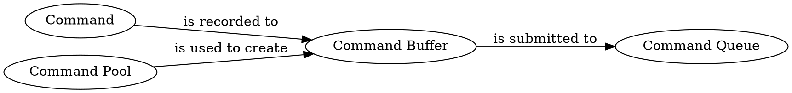
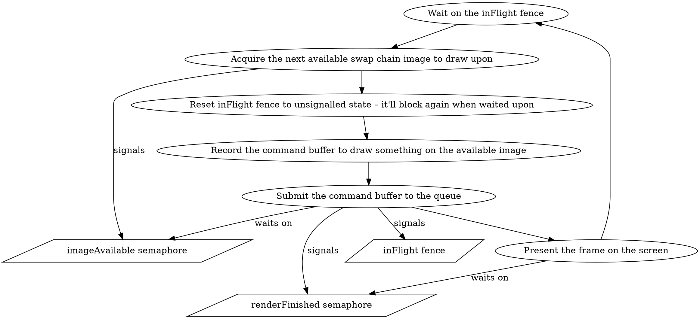

At the core of every game is its _render loop_ – the loop that renders each frame that is then displayed to the player. The API Vulkan exposes is vast, which means there is no single right way to implement a render loop in Vulkan. In this article, I'll describe the loop presented in the [Drawing](https://vulkan-tutorial.com/Drawing_a_triangle/Drawing/Framebuffers) section of the [Vulkan tutorial](https://vulkan-tutorial.com).

> This is the third article in the series where I share my impressions after following the Vulkan's tutorial using Scala 3 – here is the [first article](/posts/2022-06-10-vulkan-setup.html). For every chapter, I implement an example in a separate file. The examples repository is available on GitHub: [anatoliykmetyuk/Vulkan-Tutorial-Scala](https://github.com/anatoliykmetyuk/Vulkan-Tutorial-Scala). In its structure, it follows the [Java implementation](https://github.com/Naitsirc98/Vulkan-Tutorial-Java), so it is also a good chance to compare how Scala and Java approaches to the same task differ.

<!-- more -->

# Concetps
## Command Execution Lifecycle
We communicate to Vulkan what it needs to do via _commands_. Commands need to be submitted to a _command queue_ for processing. For efficiency, before submission to the command queue, the commands are recorded into a _command buffer_ which is created from a _command pool_. After we've recorded all the commands we wanted to the command buffer, they are submitted together, as a batch, to a command queue.

The commands submitted to a command queue are executed on the GPU.

## Concurrency Model
Many of Vulkan's commands are asynchronous. Furthermore, there are two types of "asynchronous" we are talking about:

- __Host-level__ asynchronous (_host_ being the CPU running the user program that interacts with the GPU) – means Vulkan methods that submit command buffers to the command queue return immediately, without waiting for the commands to be fully executed.
- __Device-level__ asynchronous (_device_ being the GPU on which Vulkan commands run) – means that commands that are submitted to different command queues have no synchronization guarantees. Other queue operations and methods often have insufficient [guarantees](https://www.khronos.org/registry/vulkan/specs/1.3-extensions/html/chap3.html#fundamentals-queueoperation). Furthermore, even commands that are submitted to the same command queue as part of the same command buffer [don't have](https://www.khronos.org/registry/vulkan/specs/1.3-khr-extensions/html/chap6.html) sufficient synchronization guarantees.

The above means that we need a way to synchronize between different operations we perform. Since, for example, we do not want to start rendering on an image before that image becomes available. Vulkan provides _synchronization primitives_ to synchronize between operations. Those primitives can be either _signaled_ or _unsignalled_. An operation may wait on an unsignalled primitive until another operation changes its state to signaled.

Since there are two types of asynchrony we are dealing with in Vulkan, there are also two types of synchronization primitives Vulkan provides:

- __Semaphores__ – used for the GPU-level synchronization – between command buffers submitted to different queues.
- __Fences__ – used for the CPU-level synchronization – meaning the host code the user is writing may block on them.

# Render Loop
The render loop presented in the tutorial has a swap chain queue of frames ready to be drawn upon. For example, if the swap chain has 3 frames in the queue, we can render up to 3 frames ahead of time, before they are displayed to the user. The availability of frames to render ahead of time is desired so that to ensure GPU doesn't block unnecessarily: e.g. if there is a delay in rendering one frame, we'd like the GPU to still start working on the next frame as opposed to blocking on the problematic frame and thereby impacting the end user's FPS rate.

Since there are several independent frames available, they can be rendered concurrently. We can't, however, start drawing on a frame before the previous draw operation on the same frame succeeds, so we need to synchronize between the draw operations on the same frame. This needs to be done from the host code, so we use fences for it.

Within the render loop, we call Vulkan methods to:

1. Obtain the next available swap chain image to draw on.
2. Record the commands needed to draw on it in a command buffer.
3. Submit those commands to the GPU for execution – but start working on those commands only once (1) has terminated.
4. Present the swap chain image on the screen – but only once (3) has finished execution.

Those calls will be executed asynchronously. The synchronization between those operations is done via semaphores:

- `imageAvailable` – to signal that the image is ready to be drawn upon.
- `renderFinished` – to signal that we're done with rendering on the image and it is ready to be presented on screen.

Note how we can record the command buffer before the image is even available. This is because the commands in the command buffer are only executed after they are submitted to the command queue.

You can check out how this architecture is implemented in Scala [here](https://github.com/anatoliykmetyuk/Vulkan-Tutorial-Scala/blob/7dfc9bb6387c11c4775446270d0297d97f54af25/src/main/scala/Ch21IndexBuffer.scala#L727).

# Conclusion
A key part of Vulkan's design philosophy is the explicit approach to synchronization. It doesn't provide you with too much of synchronization guarantees, so you need to enforce the guarantees you need explicitly. To that end, two kinds of synchronization primitives are provided: fences, to synchronize the CPU code with the GPU operations, and semaphores, to synchronize between the GPU operations. The user is expected to design their software with explicit synchronization in mind, so this is something to be aware of when troubleshooting your Vulkan programs.
