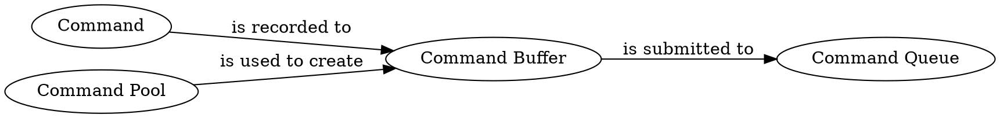
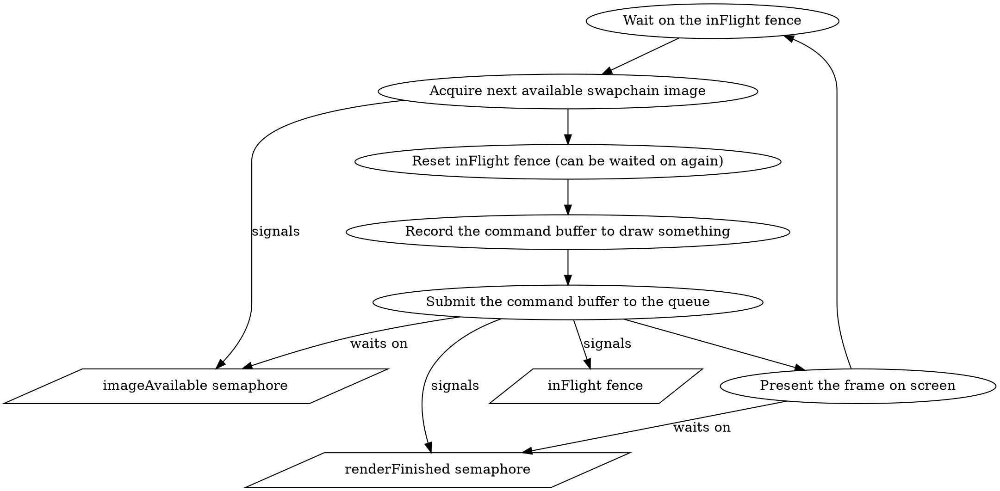

At the core of every game is its _render loop_ – the loop that renders each frame that is then displayed to the player. The API Vulkan exposes are vast, which means there is no single right way to implement a render loop in Vulkan. In this article, I'll describe the loop presented in the [Drawing](https://vulkan-tutorial.com/Drawing_a_triangle/Drawing/Framebuffers) section of the [Vulkan tutorial](https://vulkan-tutorial.com).

> This is the third article in the series where I share my impressions after following the Vulkan's tutorial using Scala 3 – here is the [first article](/posts/2022-06-10-vulkan-setup.html). For every chapter, I implement an example in a separate file. The examples repository is available on GitHub: [anatoliykmetyuk/Vulkan-Tutorial-Scala](https://github.com/anatoliykmetyuk/Vulkan-Tutorial-Scala). In its structure, it follows the [Java implementation](https://github.com/Naitsirc98/Vulkan-Tutorial-Java), so it is also a good chance to compare how Scala and Java approaches to the same task differ.

```toc
```

# Concetps
## Command Execution Lifecycle
We communicate to Vulkan what it needs to do via _commands_. Commands need to be submitted to a _command queue_ for processing. For efficiency, before submission to the command queue, the commands are recorded into a _command buffer_ which is created in a _command pool_. After we've recorded all the commands we wanted in the command buffer, they are submitted together, as a batch, to a command queue.



The commands submitted to a command queue are executed on the GPU.

## Concurrency Model
Many of the Vulkan's commands are asynchronous. Furthermore, there are two types of "asynchronous" we are talking about here:

- __Host-level__ asynchronous (_host_ being the user program executed on the CPU that interacts with the GPU) – means vulkan methods that record commands to buffers and that submit buffers to command queue return immediately, without waiting for the commands to be fully executed or submitted.
- __Device-level__ asynchronous (_device_ being the GPU on which Vulkan commands run) – means that many commands that can be submitted to the command queue are executed on the GPU in parallel. In this sense, the term command _queue_ may be misleading: the queue is true to its name only in the sense that the commands _start their execution_ in the order specified. However, they may not wait for the previous command to finish before they start their execution.

The above means that we need a way to synchronize between different operations we perform. Since, for example, we do not want to start rendering on an image before that image becomes available. Vulkan provides _synchronization primitives_ to synchronize between operations. Those primitives can be either _signalled_ or _unsignalled_. An operation may wait on the unsignalled primitive until another operation changes its state to signalled.

Since there are two types of asynchrony we are dealing with in Vulkan, there are also two types of synchronization primitives Vulkan provides:

- __Semaphores__ – used for the GPU-level synchornization – within queues between the commands submitted to them. Queue commands can wait on them and signal them.
- __Fences__ – used for the CPU-level synchronization – meaning the host code the user is writing may block on them.

# Render Loop
The render loop presented in the tutorial has a queue of frames ready to be drawn upon in its disposal from the swapchain. In case of my implementation, these are 3 frames. This means we can draw up to 3 frames ahead of time, before they are displayed to the user. This is to have a small margin to ensure good end-user experience: some frames may take longer to render, but if we are consistently 2-3 frames ahead of what the user sees, we can ensure smooth framerate by showing them the frames at the desired refresh rate.

Since there are several independent frames available, they can be rendered to concurrently. We can't, however, start drawing on a frame before the previous draw operation succeeds. So we need to synchronize the frame draw iterations with the same frame's previous draw iterations. This needs to be done from the host code, so we use fences for it.



Within the render loop, we communicate with the GPU via Vulkan to first obtain the next available swapchain image to draw on, then record the commands needed to draw on it, and finally submit those commands to the GPU for execution. The syncronization between those operations is done via semaphores:

- `imageAvailable` – to signal that the image is ready to be drawn upon. We can't submit the draw commnads before the image is ready.
- `renderFinished` – to signal that we're done with rendering on the image. We can't present the image on the screen before it is fully rendered upon.

Note how we can record the command buffer before the image is even available. This is becuase the commands in the commnad buffer are only executed after they are submitted to the command queue.

You can check out how this architecture is implemented in Scala [here](https://github.com/anatoliykmetyuk/Vulkan-Tutorial-Scala/blob/7dfc9bb6387c11c4775446270d0297d97f54af25/src/main/scala/Ch21IndexBuffer.scala#L727).

# Conclusion
The key part of the Vulkan's philosophy are parallelism and explicit synchronization. Two kinds of synchronization primitives are available: fences, to syncronize the CPU code, and semaphores, to synchronize the GPU code. No assumptions are made on how you would like to order the operations you're asking Vulkan to perform, so you need to be explicit about that via these primitives.
